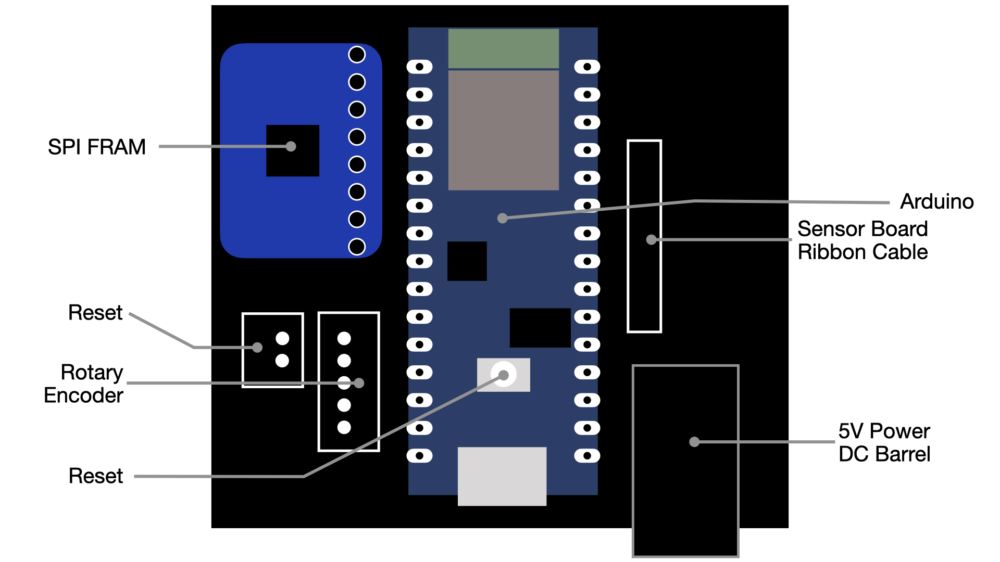
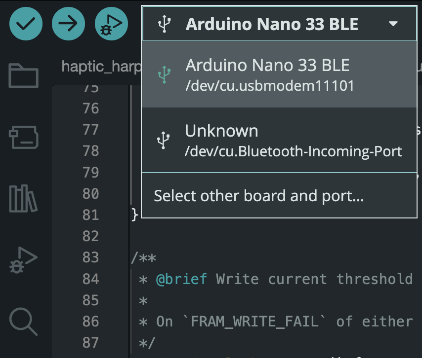
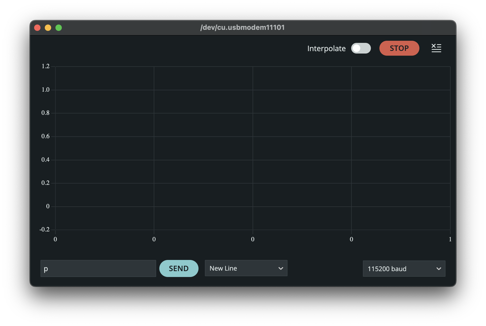

# Haprischord Firmware User Manual

## Controller Board Layout

|  |
| :---------------------------------------: |
|          Controller Board Layout          |

The Controller Board contained the following parts:

- SPI FRAM
- External reset JST Socket
- Rotary Encoder JST Socket
- Onboard Reset Button
- Arduino Nano
- Sensor Ribbon Cable
- DC Barrel Socket

The _Rotary Encoder_ and _External Reset Switch_ canbe connected at any point.
The FRAM must be plugged into its socket before the arduino is powered on otherwise the firmware will fail to initialise.

> [!CAUTION] Power On Process
> The Arduino will draw power from USB cable if the 5V power supply is not connected. Make sure to connect the power supply and turn > it on first before connecting the USB cable. Powering from USB alone may cause problems.

## Calibration

To begin calibrating, do the following:

1. Plug in a 5V supply power adaptor using the barrel jack.
2. Connect USB cable to a computer with Ardunio IDE installed.
3. Open Arduino IDE on the connected computer
4. In the device select drop down menu, click on **Arduino Nano BLE 33**. The name should now be highlighted bold highlighted bold.

|  |
| :--------------------------------: |
|    Device Select Drop Down Menu    |

5. Click the Serial Plotter icon

|  |
| :----------------------------------: |
|         Serial Plotter Icon          |

6. Send a `p` character over the serial connection to activate and deactivate printing.

|            |
| :----------------------------------------------: |
| Send a `p` over Serial to initialise the plotter |

Activating the plotting can slow down the process of reading and sending MIDI data. Plotting should be deactivated during normal playing.

> [!NOTE] 
> The the data sent conforms to the labelled printing standard of the
> [serial plotter](https://docs.arduino.cc/software/ide-v2/tutorials/ide-v2-serial-plotter/),
> as such any serial connection can be used. A limitation of the serial plotter is
> that only 6 streams of information can be printed. Using a separate environment
> printing enviornment and editing the firmware may yield a more versatile system.
> Processing would be an obvious candidate or
> [`juce_serialport.h`](https://github.com/cpr2323/juce_serialport) if this
> functionality is to be integrated with a digital instrument.

You can now use the rotary encoder to select a key. Pushing down on the rotary will cycle through the following modes

|          Mode          | LED Colour |
| :--------------------: | :--------: |
|       Key Select       |    Blue    |
|  Edit Pluck Threshold  |   Green    |
| Edit Release Threshold |   Purple   |

Double clicking the rotary encoder will save the current threshold values. A short flash of blue across all keys will confirm values have been saved. 

In key select mode, the LED for the current key will be highlighted. In the threshold editing modes, use the serial plotter to monitor the current value.

The serial plotter displays a label for each data stream: 

|           Data            | Label |
| :-----------------------: | :---: |
|        Key Sensor         | `K:`  |
|  Current Pluck Threshold  | `P:`  |
| Current Release Threshold | `R:`  |
|       Maximum Value       | `M:`  |
|       Minimum Value       | `m:`  |

The maximum and minimum values are printed to avoid automatic scaling of the y-axis, which makes calibration more difficult.

> [!NOTE] 
> There is currently a bug which results in an old label being displayed.
> Check the number against the Key, Pluck and Release thresholds to confirm
> the current key.

A [MIDI monitor application](https://www.snoize.com/MIDIMonitor/) can be used to track MIDI notes being generated.

## Troubleshooting

### Some Sensor Boards Not Responding
### Sensor Thresholds Have changed

Check that the correct supply is plugged in _and_ switched on. The Arduino Nano has a regiulated 3.3V power line that is used for the LEDs, rotary and FRAM. The sensors use the 5V power directly. Incorrect or absent power will result in a change of thresholds and some sensors may not respond as they try and draw 5V from the Arduino.
